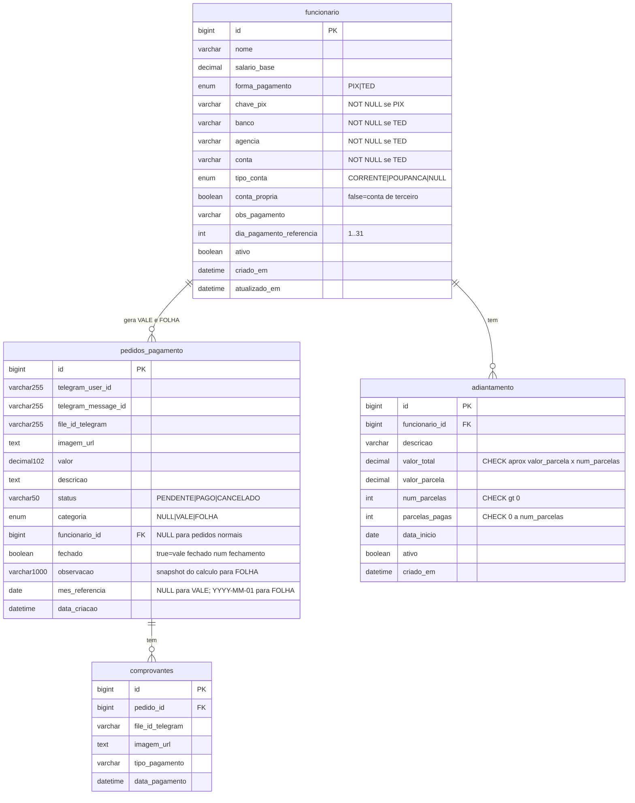

# Schema ER — financas_bot_telegram

> Diagrama e documentação do modelo de dados atual + planejado (V6).
> Atualizado pelo arquiteto a cada migration Flyway mergeada em develop.

---

## Diagrama ER



---

## Tabelas

### `pedidos_pagamento` (existente — estendida na V6)

Tabela central. Armazena pedidos normais, vales e fechamentos mensais via STI
(Single Table Inheritance). CHECK constraints garantem integridade sem tabela de extensão separada.

| Coluna | Tipo | Null | Default | Descrição |
|---|---|---|---|---|
| `id` | BIGINT | NOT NULL | AUTO_INCREMENT | PK |
| `telegram_user_id` | VARCHAR(255) | NULL | — | ID do usuário no Telegram |
| `telegram_message_id` | VARCHAR(255) | NULL | — | ID da mensagem |
| `file_id_telegram` | VARCHAR(255) | NULL | — | ID do arquivo no Telegram |
| `imagem_url` | TEXT | NULL | — | URL no S3 |
| `valor` | DECIMAL(10,2) | NULL | — | Valor do pedido ou líquido do fechamento |
| `descricao` | TEXT | NULL | — | Descrição livre |
| `status` | VARCHAR(50) | NULL | — | PENDENTE, PAGO, CANCELADO |
| `categoria` | ENUM(VALE,FOLHA) | **NULL** | NULL | **[V6]** NULL = pedido normal |
| `funcionario_id` | BIGINT | **NULL** | NULL | **[V6]** FK → funcionario.id; NULL para pedidos normais |
| `fechado` | BOOLEAN | NOT NULL | FALSE | **[V6]** TRUE = vale consumido num fechamento |
| `observacao` | VARCHAR(1000) | NULL | NULL | **[V6]** Snapshot do cálculo gerado para FOLHA |
| `mes_referencia` | DATE | **NULL** | NULL | **[V6]** Dia 1 do mês (ex: 2026-05-01); NULL para VALE e pedidos normais |
| `data_criacao` | DATETIME | NULL | — | Timestamp de criação |

**Constraints V6:**

```sql
-- Garante que VALE/FOLHA sempre têm funcionário vinculado
CONSTRAINT chk_pedido_folha CHECK (
    categoria IS NULL
    OR (categoria IN ('VALE','FOLHA') AND funcionario_id IS NOT NULL)
)
-- Garante que todo fechamento (FOLHA) tem mês de referência explícito
CONSTRAINT chk_pedido_folha_mes CHECK (
    categoria <> 'FOLHA' OR mes_referencia IS NOT NULL
)
```

**Índices V6:**

```sql
-- Idempotência de fechamento por UNIQUE INDEX.
-- NULLs em UNIQUE MySQL são distintos entre si (NULL <> NULL):
--   VALE pedidos  → mes_referencia=NULL → múltiplos (func_id, NULL) coexistem ✓
--   FOLHA pedidos → mes_referencia='YYYY-MM-01' → único por funcionário/mês ✓
--   Pedidos normais → (NULL, NULL) → coexistem ✓
UNIQUE INDEX uq_folha_por_mes (funcionario_id, mes_referencia)
-- Cobertura das queries de FecharMesUseCase e listagem de folha
INDEX idx_pedido_folha (funcionario_id, categoria, fechado, data_criacao DESC)
```

**FK V6:**

```sql
FOREIGN KEY (funcionario_id) REFERENCES funcionario(id) ON DELETE RESTRICT
```

---

### `comprovantes` (existente — sem alteração na V6)

Vales (categoria=VALE) herdam este mecanismo gratuitamente — registrar comprovante
de um vale é idêntico a qualquer outro pedido.

| Coluna | Tipo | Null | Descrição |
|---|---|---|---|
| `id` | BIGINT | NOT NULL | PK |
| `pedido_id` | BIGINT | NOT NULL | FK → pedidos_pagamento.id |
| `file_id_telegram` | VARCHAR(255) | NULL | — |
| `imagem_url` | TEXT | NULL | URL no S3 |
| `tipo_pagamento` | VARCHAR(255) | NULL | Texto livre: pix, ted… *(dívida técnica)* |
| `data_pagamento` | DATETIME | NULL | @CreationTimestamp |

---

### `funcionario` (nova — V6)

Funcionário doméstico. Soft-delete via `ativo=false`. `atualizado_em` rastreia
mudanças de salário e dados bancários.

| Coluna | Tipo | Null | Default | Descrição |
|---|---|---|---|---|
| `id` | BIGINT | NOT NULL | AUTO_INCREMENT | PK |
| `nome` | VARCHAR(120) | NOT NULL | — | Nome completo |
| `salario_base` | DECIMAL(10,2) | NOT NULL | — | Salário base mensal |
| `forma_pagamento` | ENUM(PIX,TED) | NOT NULL | — | — |
| `chave_pix` | VARCHAR(255) | NULL | NULL | Obrigatório se PIX (CHECK) |
| `banco` | VARCHAR(50) | NULL | NULL | Obrigatório se TED |
| `agencia` | VARCHAR(20) | NULL | NULL | Obrigatório se TED |
| `conta` | VARCHAR(30) | NULL | NULL | Obrigatório se TED |
| `tipo_conta` | ENUM(CORRENTE,POUPANCA) | NULL | NULL | Obrigatório se TED |
| `conta_propria` | BOOLEAN | NOT NULL | TRUE | FALSE = conta de terceiro |
| `obs_pagamento` | VARCHAR(500) | NULL | NULL | Instrução de pagamento |
| `dia_pagamento_referencia` | INT | NULL | NULL | Dia 1..31 — informativo |
| `ativo` | BOOLEAN | NOT NULL | TRUE | FALSE = desligado |
| `criado_em` | DATETIME | NOT NULL | CURRENT_TIMESTAMP | — |
| `atualizado_em` | DATETIME | NOT NULL | CURRENT_TIMESTAMP | ON UPDATE CURRENT_TIMESTAMP |

**Constraints:**

```sql
CONSTRAINT chk_func_pix CHECK (
    forma_pagamento <> 'PIX' OR chave_pix IS NOT NULL
)
CONSTRAINT chk_func_ted CHECK (
    forma_pagamento <> 'TED'
    OR (banco IS NOT NULL AND agencia IS NOT NULL AND conta IS NOT NULL AND tipo_conta IS NOT NULL)
)
CONSTRAINT chk_func_dia CHECK (
    dia_pagamento_referencia IS NULL OR dia_pagamento_referencia BETWEEN 1 AND 31
)
```

---

### `adiantamento` (nova — V6)

Plano de desconto parcelado. O `FecharMesUseCase` incrementa `parcelas_pagas` a cada
fechamento e marca `ativo=false` quando quitado.

| Coluna | Tipo | Null | Default | Descrição |
|---|---|---|---|---|
| `id` | BIGINT | NOT NULL | AUTO_INCREMENT | PK |
| `funcionario_id` | BIGINT | NOT NULL | — | FK → funcionario.id |
| `descricao` | VARCHAR(255) | NOT NULL | — | Ex: Adiantamento agosto 2026 |
| `valor_total` | DECIMAL(10,2) | NOT NULL | — | Total do adiantamento |
| `valor_parcela` | DECIMAL(10,2) | NOT NULL | — | Valor de cada parcela |
| `num_parcelas` | INT | NOT NULL | — | Total de parcelas |
| `parcelas_pagas` | INT | NOT NULL | 0 | Incrementado a cada fechamento |
| `data_inicio` | DATE | NOT NULL | — | Mês de início do desconto |
| `ativo` | BOOLEAN | NOT NULL | TRUE | FALSE = cancelado ou quitado |
| `criado_em` | DATETIME | NOT NULL | CURRENT_TIMESTAMP | — |

**Constraints:**

```sql
-- valor_total = valor_parcela × num_parcelas, tolerância 1 centavo
CONSTRAINT chk_adiant_consistencia CHECK (
    ABS(valor_total - (valor_parcela * num_parcelas)) <= 0.01
)
CONSTRAINT chk_adiant_parcelas CHECK (parcelas_pagas BETWEEN 0 AND num_parcelas)
CONSTRAINT chk_adiant_valores   CHECK (valor_total > 0 AND valor_parcela > 0 AND num_parcelas > 0)
```

**FK:**

```sql
FOREIGN KEY (funcionario_id) REFERENCES funcionario(id) ON DELETE RESTRICT
```

**Índice:**

```sql
-- Cobre a query do FecharMesUseCase:
-- WHERE funcionario_id=? AND ativo=TRUE AND data_inicio <= primeiroDiaMes
INDEX idx_adiant_func_ativo (funcionario_id, ativo, data_inicio)
```

---

## Dívidas técnicas de schema

| Item | Tabela | Descrição | Prioridade |
|---|---|---|---|
| `status VARCHAR(50)` | `pedidos_pagamento` | Deveria ser ENUM(PENDENTE,PAGO,CANCELADO) | Baixa |
| `tipo_pagamento VARCHAR(255)` | `comprovantes` | Texto livre sem padronização | Baixa |
| Sem `updated_at` | `pedidos_pagamento`, `comprovantes` | Sem rastreabilidade de mudanças | Baixa |

---

## Histórico de migrações Flyway

| Versão | Conteúdo | Status |
|---|---|---|
| V1 | Schema inicial (pedidos_pagamento, comprovantes) | Aplicado |
| V2–V5 | Evoluções intermediárias | Aplicados |
| **V6** | Folha de pagamento (funcionario, adiantamento, extensão de pedidos_pagamento) | **Planejado — Sprint 03** |
